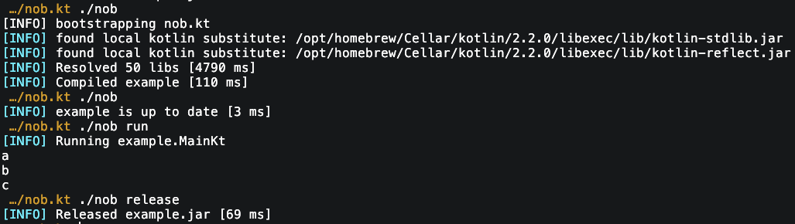

<svg width="600" height="80" viewBox="0 0 600 80" xmlns="http://www.w3.org/2000/svg">
    <rect width="600" height="80" fill="#111827" rx="8"/>
    <text 
        x="300" 
        y="55" 
        font-family="monospace" 
        font-size="56" 
        fill="#06b6d4" 
        text-anchor="middle" 
        font-weight="bold" 
        letter-spacing="4"
        style="
            font-family: monospace; 
            text-shadow: 0 0 5px rgba(6, 182, 212, 0.8), 0 0 10px rgba(6, 182, 212, 0.5);">nob.kt</text>
    <rect x="420" y="28" width="10" height="28" fill="#facc15" rx="2" opacity="0.7"/>
</svg>

# nob.kt - NoBuild for Kotlin
This is inspired by the header only library version for C [https://github.com/tsoding/nob.h](https://github.com/tsoding/nob.h)

Build your Kotlin project with kotlin.

# Features
- Builds itself automatically
- Uses a kotlin daemon for faster compilation
- Resolves maven and gradle dependencies
- Supports your own test runner and junit

# Setup
- clone `nob` and `nob.kt` into your project.
- ensure `KOTLIN_LIB` is on your PATH pointing to the kotlinc/lib with kotlin-stdlib.jar, kotlin-compiler.jar, etc

# Usage
Bootstrap nob.kt
> ./nob

Create your module(s) and a CLI for your usage:
```kotlin
fun main(args: Array<String>) {
    val nob = Nob.new(args)

    val example = nob.module {
        name = "example"
        src = "example"
        libs = listOf(
            Lib.of("io.ktor:ktor-server-netty:3.2.2"),
            Lib.of("org.slf4j:slf4j-simple:2.0.17"),
        )
    }

    nob.compile(example)

    when(val arg = args.getOrNull(0)) {
        "run" -> nob.run(example, "MainKt")
        "release" -> nob.release(example)
        "debug" -> {
            nob.opts.debug = true
            nob.run(example, "MainKt")
        }
    }

    nob.exit()
}
```

Start debug mode:
>./nob debug

Attach debugger:
> jdb -attach 5005

## Example


Tune `Opts` with your preferences: 
```kotlin
data class Opts(
    var jvm_version: Int = 21,
    var kotlin_version: String = "2.2.0",
    var kotlin_home: Path = Paths.get(System.getenv("KOTLIN_LIB")),
    var backend_threads: Int = 0, // run codegen with N thread per processor (Default 1)
    var verbose: Boolean = false,
    var error: Boolean = true,
    var extra: Boolean = false,
    var debug: Boolean = false,
)
```

